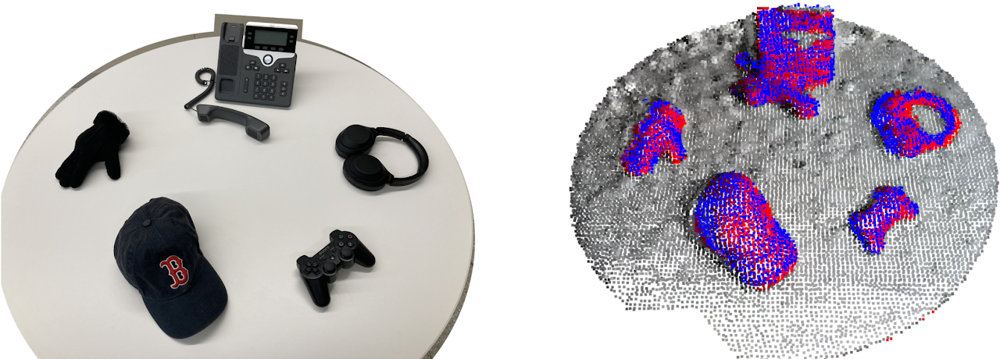

# FLS: Scale-Invariant Fast Functional Registration 



This repositoriy contains implementaion of the functional least-squares (FLS) algorithm from to the paper *[Scale-Invariant Fast Functional Registration](https://arxiv.org/abs/2209.12763)*. 

FLS is a point cloud registration algorithm with support for unknown scale, partial overlap, and varying densities. More demonstrations can found in the [project website](https://sites.google.com/view/fls-isrr2022/).

This repository contains implementation of FLS in two forms: (1) a C++ library that can easily used for computer vision tasks; (2) a JAX implementation with potential application in learning-based task.

If you find FLS helpful and use it your projects, please cite the project as below:

```
@INPROCEEDINGS{SunM-ISRR-22, 
    AUTHOR    = {Muchen Sun AND Allison Pinosky AND Ian Abraham AND Todd Murphey}, 
    TITLE     = {{Scale-Invariant Fast Functional Registration}}, 
    BOOKTITLE = {Proceedings of International Symposium of Robotics Research}, 
    YEAR      = {2022}, 
    ADDRESS   = {Geneva, Switzerland}, 
    MONTH     = {September}
}
```

## C++ Implementation

The source code of the C++ implementation is under the directory `fls-plusplus`. Information regarding installation and usage can be found under the same directory.

## JAX Implementation

The source code of the [JAX](https://github.com/google/jax) implementation is under the directory `fls-jax`. Information regarding installation and usage can be found under the same directory. You can try the algorithm without installation via [**Colab**](https://colab.research.google.com/github/MurpheyLab/FLS/blob/master/fls-jax/tutorial_2.ipynb).

## Copyright and License

The implementations contained herein are copyright (C) 2021 - 2022 by Muchen Sun, and are distributed under the terms of the GNU General Public License (GPL) version 3 (or later). Please see the LICENSE for more information.

Contact: muchen@u.northwestern.edu

Lab Info: Prof. Todd D. Murphey, [Interactive & Emergent Autonomy Lab](https://murpheylab.github.io/) / [Center for Robotics and Biosystems](https://robotics.northwestern.edu/) / Northwestern University
